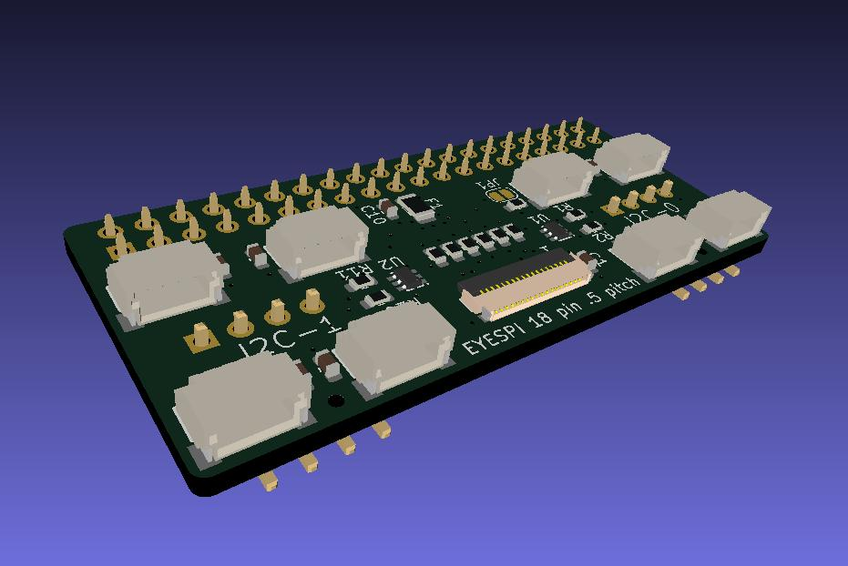

# EYESPI-Dual_I2C

## Introduction
EYESPI-Dual_I2C is an EYESPI display port and dual I2C 5 port hubs that can be deployed with passive or active termination on most SBC using their 40 pin GPIO. 

License: GPLv3.
